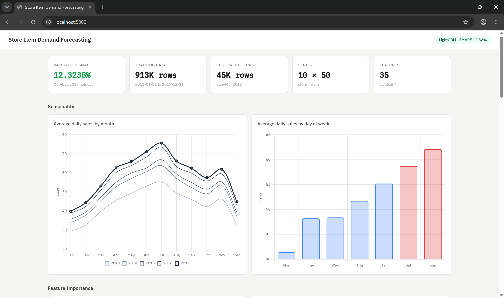
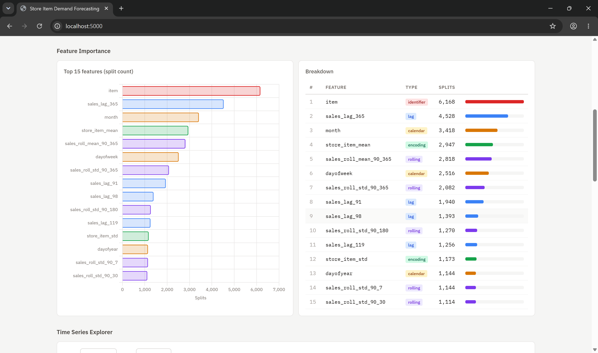
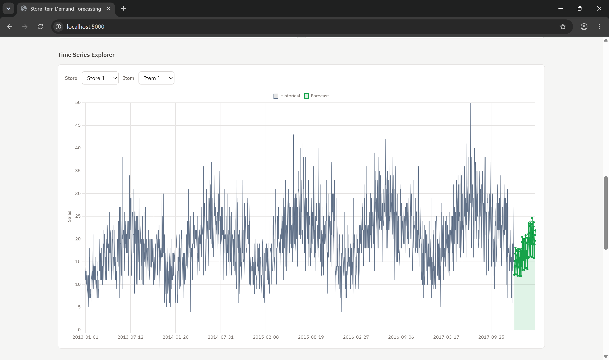
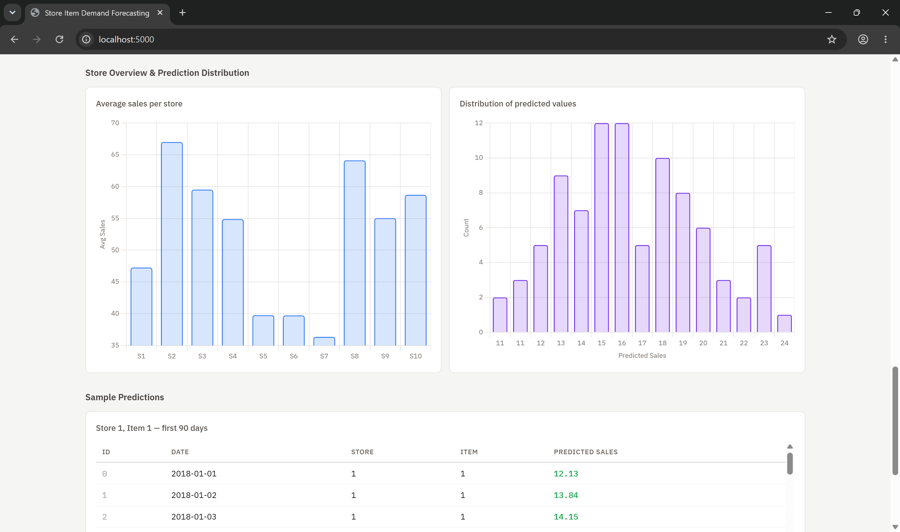
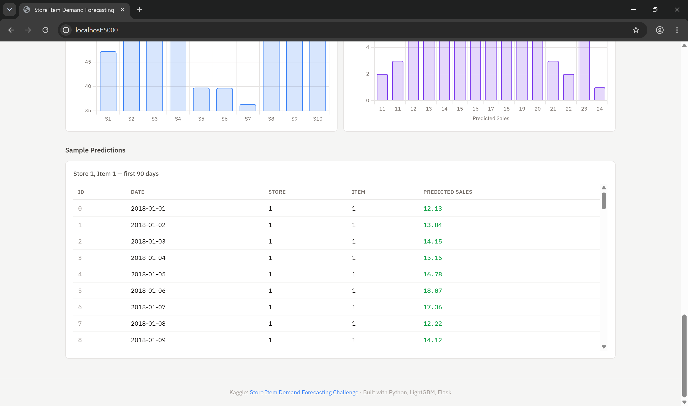

# Store Item Demand Forecasting

> **Kaggle Competition**: [Store Item Demand Forecasting Challenge](https://www.kaggle.com/competitions/demand-forecasting-kernels-only/overview)

A production-grade demand forecasting pipeline that predicts **3 months of daily sales** for 50 items across 10 stores using 5 years of historical data. Built with **LightGBM**, advanced time-series feature engineering, and an **interactive Flask dashboard** for visualizing predictions and dataset statistics.

---

## Table of Contents

- [Problem Statement](#problem-statement)
- [Dataset](#dataset)
- [Approach](#approach)
- [Project Structure](#project-structure)
- [Setup & Installation](#setup--installation)
- [How to Run](#how-to-run)
- [Results](#results)
- [Feature Engineering](#feature-engineering)
- [Model Architecture](#model-architecture)
- [Visualizations](#visualizations)
- [Future Improvements](#future-improvements)

---

## Problem Statement

The challenge requires forecasting daily demand across **500 store-item combinations** (10 stores × 50 items). The key challenges include:

- Capturing both **series-specific dynamics** and **shared temporal structures**
- Handling **weekly**, **monthly**, and **yearly seasonality**
- Managing **autocorrelation** across multiple horizons
- Ensuring **scalability** across a large number of related time series
- Generating reliable **multi-horizon forecasts** (90 days ahead)

**Evaluation Metric**: SMAPE (Symmetric Mean Absolute Percentage Error)

---

## Dataset

| File | Rows | Columns | Description |
|------|------|---------|-------------|
| `train.csv` | 913,000 | 4 | Historical daily sales (2013-01-01 to 2017-12-31) |
| `test.csv` | 45,000 | 4 | Prediction period (2018-01-01 to 2018-03-31) |

**Columns**: `date`, `store` (1–10), `item` (1–50), `sales` (target)

---

## Approach

1. **Global Model Strategy**: Instead of fitting 500 individual models, we train a single LightGBM model across all store-item combinations, allowing the model to learn shared patterns while using `store` and `item` as categorical features for series-specific behavior.

2. **Log Transform + L1 Loss**: We apply `log1p(sales)` to the target and use MAE (L1) loss, which serves as an excellent proxy for SMAPE optimization.

3. **Time-Based Validation**: The last 3 months of training data (Oct–Dec 2017) are held out as validation, perfectly mirroring the 90-day test horizon.

4. **Full Retrain for Inference**: After validation, the model is retrained on all 5 years of data using the optimal iteration count (scaled by 1.1×) before predicting on the test set.

---

## Project Structure

```
store_item_demand_forecasting/
│
├── data/                       # Downloaded dataset files
│   ├── train.csv               # Training data (5 years, 913K rows)
│   └── test.csv                # Test data (3 months, 45K rows)
│
├── src/                        # Source modules
│   ├── __init__.py             # Package initializer
│   ├── features.py             # Feature engineering pipeline
│   └── model.py                # LightGBM training, validation & inference
│
├── output/                     # Generated outputs
│   ├── submission.csv          # Final Kaggle submission file
│   └── plots/                  # Visualization outputs
│       ├── feature_importance.png
│       ├── prediction_distribution.png
│       ├── monthly_sales_trend.png
│       └── store_item_heatmap.png
│
├── main.py                     # End-to-end pipeline orchestrator
├── app.py                      # Flask interactive dashboard backend
├── templates/                  # HTML templates for the frontend
│   └── index.html              # Clean, human-centered dashboard UI
├── download_data.py            # Dataset downloader (from GitHub)
├── eda.py                      # Exploratory Data Analysis & visualizations
├── requirements.txt            # Python dependencies
├── .gitignore                  # Git ignore rules
└── README.md                   # This file
```

---

## Setup & Installation

### Prerequisites

- Python 3.10+

### Install Dependencies

```bash
pip install -r requirements.txt
```

### Download Dataset

The dataset is automatically downloaded when you run the pipeline. To download manually:

```bash
python download_data.py
```

---

## How to Run

### Full Pipeline (Train + Validate + Predict)

```bash
python main.py
```

This will:
1. Load and parse the training & test datasets
2. Engineer 35 features (calendar, lag, rolling, target encodings)
3. Train a LightGBM model with early stopping on a time-based validation split
4. Report the validation SMAPE score
5. Retrain on the full dataset and generate test predictions
6. Save `output/submission.csv`

### Interactive Web Dashboard

Launch the clean, minimal local web dashboard to interactively explore predictions, time series data, and feature importance:

```bash
python app.py
```
Open `http://localhost:5000` in your browser.

### Exploratory Data Analysis & Visualizations

```bash
python eda.py
```

Generates publication-quality plots saved to `output/plots/`.

---

## Results

| Metric | Score |
|--------|-------|
| **Validation SMAPE** | **12.32%** |
| Best LightGBM Iteration | 1,633 (of max 3,000) |
| Final Model Iterations | 1,796 (1.1× best) |

### Submission Statistics

| Statistic | Value |
|-----------|-------|
| Total Predictions | 45,000 |
| Mean Predicted Sales | 46.90 |
| Std Dev | 23.39 |
| Min | 8.35 |
| Max | 139.44 |
| Null Values | 0 |

---

## Feature Engineering

### 35 Features in 4 Categories

| Category | Count | Features |
|----------|-------|----------|
| **Calendar** | 7 | `year`, `month`, `day`, `dayofweek`, `dayofyear`, `is_weekend`, `weekofyear` |
| **Lag** | 10 | `sales_lag_{90,91,92,98,105,112,119,126,180,365}` |
| **Rolling** | 10 | `sales_roll_{mean,std}_90_{7,30,90,180,365}` |
| **Target Encoding** | 6 | `{store,item,store_item}_{mean,std}` |
| **Identifiers** | 2 | `store`, `item` (as categoricals) |

> **Key Design Decision**: Minimum lag = 90 days. Since the prediction horizon is 90 days, using shorter lags would cause data leakage in a direct forecasting setup.

---

## Model Architecture

```
LightGBM Regressor
├── Objective: regression_l1 (MAE on log-transformed target)
├── Learning Rate: 0.03
├── Num Leaves: 31
├── Max Depth: 8
├── Subsample: 0.8
├── Col Sample by Tree: 0.8
├── Early Stopping: 150 rounds
└── Validation: Time-based split (train < 2017-10-01, val = Oct–Dec 2017)
```

### Top 5 Features by Importance

1. **`item`** (6,168 splits) — Item-level baseline demand
2. **`sales_lag_365`** (4,528 splits) — Yearly seasonality
3. **`month`** (3,418 splits) — Monthly seasonality
4. **`store_item_mean`** (2,947 splits) — Historical average sales
5. **`sales_roll_mean_90_365`** (2,818 splits) — Annual rolling trend

---

## Visualizations

Run `python eda.py` to generate the following plots in `output/plots/`:

- **Feature Importance** — Top 15 features ranked by LightGBM split count
- **Prediction Distribution** — Histogram of forecasted sales values
- **Monthly Sales Trend** — Average sales by month showing seasonality
- **Store-Item Heatmap** — Average sales across all store-item combinations

---

## Future Improvements

- **Ensemble Methods**: Combine LightGBM with XGBoost and CatBoost for a stacked ensemble
- **Recursive Forecasting**: Use shorter lags (1, 7, 14 days) with recursive multi-step prediction
- **External Features**: Incorporate holiday calendars, promotions, and weather data
- **Hyperparameter Tuning**: Use Optuna for Bayesian hyperparameter optimization
- **Neural Approaches**: Experiment with N-BEATS, Temporal Fusion Transformers (TFT)

## Screenshots






## Run the Web Application

Start the Flask server:

```bash
python app.py
```

Then open your browser and visit:

```
http://localhost:5000/
```

---


## License

This project uses the dataset from the [Kaggle Store Item Demand Forecasting Challenge](https://www.kaggle.com/competitions/demand-forecasting-kernels-only). Please refer to Kaggle's competition rules for data usage terms.
